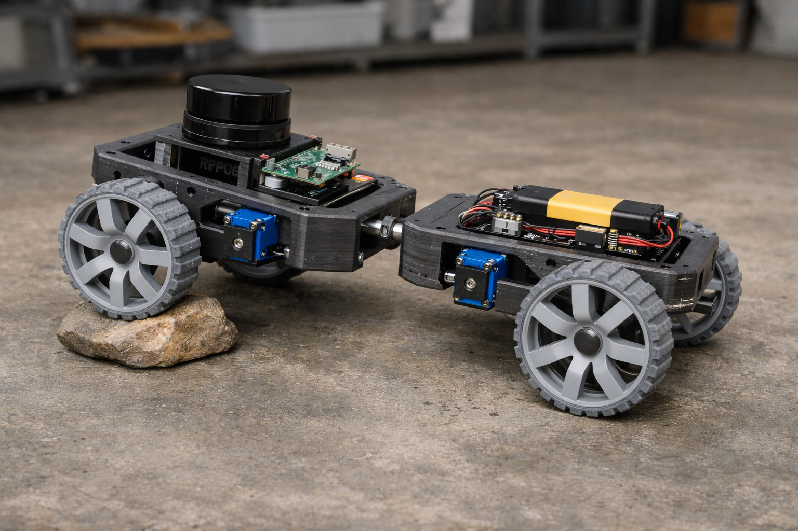

# Pivot Rocker Frame Design



Simple center-pivot suspension for roverbot.v1. Two frame halves rock independently, keeping all 4 wheels on the ground over uneven terrain.

---

## Concept

```
SIDE VIEW - FLAT GROUND

    ┌─────────────┐         ┌─────────────┐
    │  FRONT HALF │────●────│  REAR HALF  │
    └──────○──────┘   pivot └──────○──────┘
           wheel                   wheel


SIDE VIEW - UNEVEN TERRAIN

         ┌─────────────┐
         │  FRONT HALF │╲
         └──────○──────┘ ●────┐
               wheel     pivot└─────────────┐
                               │  REAR HALF  │
                               └──────○──────┘
                                      wheel
```

All 4 wheels maintain ground contact. No springs, no complex linkages.

---

## Design Overview

```
TOP VIEW

                        500mm
    ←─────────────────────────────────────────→

    ○ wheel                             wheel ○
    │                                         │
    ├──[ARM]──┐                   ┌──[ARM]──┤    ↑
              │                   │               │
              │   FRONT HALF      │               │
              │    200×250mm      │               │
              │                   │               │
              │    ┌───────┐      │               │
              │    │ LIDAR │      │               │
              │    └───────┘      │               │
              │    [Pi 5]         │               │
              └────────┬┬─────────┘               │
                       ││                         │ 350mm
                       ●● ← pivot (8mm rod)       │
                       ││                         │
              ┌────────┴┴─────────┐               │
              │                   │               │
              │   REAR HALF       │               │
              │    200×250mm      │               │
              │                   │               │
              │   ┌──────────┐    │               │
              │   │ BATTERY  │    │               │
              │   └──────────┘    │               │
              │                   │               │
    ├──[ARM]──┘                   └──[ARM]──┤    ↓
    │                                         │
    ○ wheel                             wheel ○
```

---

## Printed Parts

### Frame Bodies (2 pieces)

| Part | Size | Weight | Time | Notes |
|------|------|--------|------|-------|
| Front half | 200×250×40mm | 180g | 4 hrs | Lidar mount, Pi tray integrated |
| Rear half | 200×250×40mm | 200g | 5 hrs | Battery bay, electronics tray integrated |

Print flat on bed. PETG, 40% infill, 3 walls.

### Servo Arms (4 pieces)

| Part | Size | Weight | Time | Notes |
|------|------|--------|------|-------|
| Servo arm | 80×60×30mm | 20g | 1 hr | LX-16A pocket, M3 heat-set inserts |

Print flat. PETG, 50% infill for strength.

### Pivot Hardware (2 pieces)

| Part | Size | Weight | Time | Notes |
|------|------|--------|------|-------|
| Pivot bushing | 30×20mm | 5g | 15 min | Spaced 40mm apart for stability |

Or use bronze bushings for durability.

### Summary

| Component | Qty | Weight | Time |
|-----------|-----|--------|------|
| Frame bodies | 2 | 380g | 9 hrs |
| Servo arms | 4 | 80g | 4 hrs |
| Pivot bushings | 2 | 10g | 0.5 hr |
| **Frame total** | | **470g** | **~14 hrs** |

---

## Pivot Mechanism

```
SECTION VIEW AT PIVOT

    FRONT HALF              REAR HALF
    ┌────────┐              ┌────────┐
    │        │   ┌──────┐   │        │
    │     ┌──┴───┤ bush ├───┴──┐     │
    │     │      └──────┘      │     │
    │     │   ════════════     │     │  ← 8mm aluminum rod
    │     │      ┌──────┐      │     │
    │     └──┬───┤ bush ├───┬──┘     │
    │        │   └──────┘   │        │
    └────────┘              └────────┘
              ↑            ↑
         40mm spacing prevents wobble
```

### Parts
- 1× 8mm aluminum rod, 100mm length (from existing stock)
- 2× printed bushings OR 2× bronze 8mm bushings
- 2× M3 set screws to lock rod position

### Range Limiters
- Integrated stops in bushing housing
- Limit rotation to ±15°
- Prevents wire pinching and over-extension

---

## Wire Routing

```
    FRONT HALF                    REAR HALF

    [servo]──────┐          ┌──────[servo]
    [servo]──────┤          ├──────[servo]
                 │          │
    [Pi 5]───────┤          │
    [lidar]──────┤          │
                 │  ╭────╮  │
                 └──│    │──┴──[controller]
                    │flex│
                    │loop│     [battery]──[buck]──┘
                    ╰────╯
                      ↑
              slack loop at pivot
              allows ±15° rotation
```

### Wire Bundle
- LX-16A serial bus (3 wire)
- 5V power to Pi, lidar
- Ground

Use spiral wrap with 50mm slack loop at pivot.

---

## Assembly

### 1. Prepare Frame Bodies
- Install M3 heat-set inserts for arm mounting (4 per body)
- Install heat-set inserts for electronics mounting

### 2. Prepare Servo Arms
- Install M3 heat-set inserts for servo mounting (4 per arm)
- Test fit LX-16A servos

### 3. Install Pivot
- Press bushings into frame body pivot housings
- Insert 8mm rod through both bodies
- Secure with set screws
- Test rocking motion (should be smooth, ±15°)

### 4. Attach Arms
- Bolt servo arms to frame bodies (M3×12mm)
- Arms should extend outward to achieve 350mm track width

### 5. Install Servos
- Mount LX-16A servos in arm pockets
- Secure with M3 screws into heat-set inserts

### 6. Wire Routing
- Route servo bus through pivot area
- Create slack loop with spiral wrap
- Test full pivot range doesn't pinch wires

### 7. Electronics
- Mount Pi 5 in front half
- Mount battery in rear half
- Connect power and servo controller

---

## Comparison vs Other Frame Options

| Aspect | Panel Frame (D) | Pivot Rocker |
|--------|-----------------|--------------|
| Parts | 10+ panels | 6 pieces |
| Weight | 800g | 470g |
| Print time | 20 hrs | 14 hrs |
| Joints | 8+ bolted | 4 arm bolts + 1 pivot |
| Terrain | Rigid | Adaptive |
| Complexity | Medium | Low |
| Repair | Replace panel | Replace arm or half |

---

## Specifications

| Spec | Value |
|------|-------|
| Frame weight | 470g |
| Track width | 350mm |
| Wheelbase | 500mm |
| Ground clearance | 60mm |
| Pivot range | ±15° |
| Print bed required | 250×220mm |
| Material | PETG recommended |
| Print time | ~14 hrs (frame only) |

---

## Design Files Needed

```
pivot_front_half.stl      (×1)
pivot_rear_half.stl       (×1)
servo_arm_left.stl        (×2)
servo_arm_right.stl       (×2, mirrored)
pivot_bushing.stl         (×2)
pivot_stop.stl            (×2, optional)
```

---

## Notes

- Pivot design inspired by [RobotShop forum 4WD rocker rover](https://community.robotshop.com/forum/t/my-4wd-rocker-bogie-suspension-rover/2324)
- Much simpler than full rocker-bogie but effective for indoor/outdoor use
- Rear-heavy by ~200g - consider shifting pivot 30mm rearward to balance
- Bronze bushings recommended for outdoor/dusty environments

---

*Pivot rocker frame for roverbot.v1 - simple suspension, all parts fit standard print beds*
