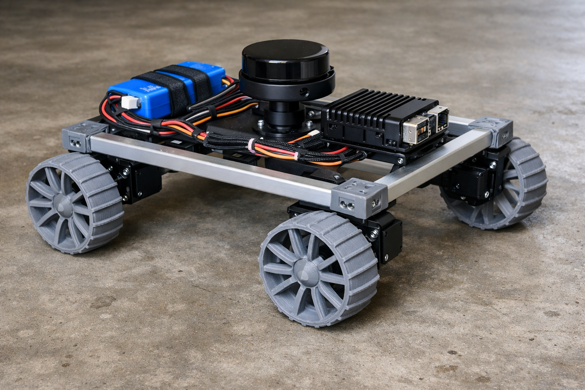

# roverbot.v1: LX-16A Serial Bus Rover



A robust rover platform built around Hiwonder LX-16A serial bus servos with Sawppy-style 3D printed wheels and 1.9 kg payload capacity.

## Design Philosophy

This platform maximizes size while maintaining a **3:1 thrust-to-weight ratio** for reliable indoor/outdoor performance. Designed for ROS2 learning, SLAM mapping, and expandability (robot arm, additional sensors).

## Specifications

| Spec | Value |
|------|-------|
| Chassis | 500×350mm (20"×14") |
| Wheels | 120mm Sawppy-style (3D printed) |
| Weight | ~4.5 kg max |
| Ground Clearance | 60mm |
| Max Speed | 0.34 m/s |
| Thrust:Weight | 3:1 |
| Frame | Fully 3D printed (panels) |
| Battery | 2S LiPo |
| Runtime | ~4 hours |
| Payload | 1.9 kg |

## Torque Budget

**LX-16A with 120mm Sawppy wheels:**
- Torque: 20 kg.cm = 1.96 Nm per servo
- Wheel radius: 60mm = 0.06m
- Force per wheel: 1.96 ÷ 0.06 = **32.7 N**
- Total thrust (4 wheels): **131 N**
- Target weight: 4.5 kg = 44 N
- **Thrust-to-weight: 3:1** ✓

### Performance Envelope

| Scenario | Required Ratio | Max Weight | Status |
|----------|---------------|------------|--------|
| Flat indoor | 2:1 | 6.7 kg | ✓ |
| Carpet/outdoor | 3:1 | 4.4 kg | ✓ |
| 15° incline | 4:1 | 3.3 kg | marginal |
| 20° incline | 5:1 | 2.7 kg | ✗ |

**Recommended max weight: 4.0-4.5 kg** for versatile indoor/outdoor use.

## Weight Budget

| Component | Weight |
|-----------|--------|
| 4x LX-16A servos | 216g |
| 4x 120mm Sawppy wheels (printed) | 300g |
| 4x wheel hubs + couplers (printed) | 120g |
| 8mm drive shafts | 20g |
| 3D printed frame (pivot) | 470g |
| 3D printed mounts (lidar, misc) | 50g |
| 2S 10000mAh LiPo | 450g |
| Raspberry Pi 5 + case | 150g |
| RPLidar A1 | 170g |
| RealSense D435 (optional) | 72g |
| BNO055 IMU | 10g |
| Electronics (buck, wiring) | 150g |
| Payload margin | ~1.2 kg |
| **TOTAL** | **~2.3 kg base** |

Leaves **~2.2 kg payload capacity** for accessories (robot arm, gripper, etc.)

## Frame Design

Multiple options available (see [FRAME_OPTIONS.md](FRAME_OPTIONS.md)):

| Option | Weight | Cost | Best For |
|--------|--------|------|----------|
| B: Hybrid Modular | 450g | $15 | Lightest, fastest print, rigid |
| **E: Pivot Rocker** | **470g** | **$12** | **Default - has suspension** |

### Default: Pivot Rocker Suspension (Option E)

See [PIVOT_FRAME.md](PIVOT_FRAME.md) for full details.

```
        500mm (20")
    ┌─────────────────────────────────────────────┐
    │                                             │
    │   ┌─────┐    FRONT HALF      ┌─────┐       │
    │   │ S1  │     [lidar]        │ S2  │       │
    │   └──┬──┘     [Pi 5]         └──┬──┘       │
    │      ○ 120mm                120mm ○        │  350mm
    │                                             │  (14")
    │               ════●════  ← pivot            │
    │                                             │
    │      ○ 120mm                120mm ○        │
    │   ┌──┴──┐    REAR HALF       ┌──┴──┐       │
    │   │ S3  │   [battery]        │ S4  │       │
    │   └─────┘   [electronics]    └─────┘       │
    │                                             │
    └─────────────────────────────────────────────┘
```

**3D printed frame parts (~470g, ~14 hrs):**
- 1x Front half (200×250mm)
- 1x Rear half (200×250mm)
- 4x Servo arms (80×60mm each)
- 2x Pivot bushings

## Sensor Configuration

```
                    FRONT
         ┌─────────────────────────┐
         │      [RPLidar A1]       │  ← Elevated on 50mm standoff
         │           ○             │
         │                         │
         │    [RealSense D435]     │  ← Front-facing depth
         │         ═══             │
         │                         │
         │  ┌─────────────────┐    │
         │  │   [Pi 5]        │    │
         │  │   [IMU]         │    │
         │  │   [Power dist]  │    │
         │  └─────────────────┘    │
         │                         │
         │      [Battery Bay]      │
         │     ┌───────────┐       │
         │     │  10Ah 2S  │       │
         │     └───────────┘       │
         └─────────────────────────┘
                    REAR
```

## Power Architecture

```
2S LiPo 10000mAh (7.4V, 74Wh)
         │
         ├──[20A Fuse]
         │
         ├── LX-16A Bus (direct 7.4V) ─── 4A peak
         │
         └── 5V 6A Buck ─────────────┬── Pi 5 (3A)
                                     ├── RPLidar (0.5A)
                                     ├── RealSense (0.8A)
                                     └── IMU, misc (0.2A)

Peak draw: ~35W
Cruise draw: ~18W
Runtime: 74Wh ÷ 18W = ~4 hours
```

## Expansion Options

With ~1.9 kg payload capacity, consider:

| Add-on | Weight | Notes |
|--------|--------|-------|
| 3-DOF robot arm | 400-800g | Pick and place |
| Pan-tilt camera | 150g | Surveillance |
| Speaker + mic array | 100g | Voice interaction |
| LED light bar | 50g | Night operation |
| Additional sensors | 200g | Ultrasonic, gas, etc. |

## Documents

- [SHOPPING_LIST.md](SHOPPING_LIST.md) - Complete parts list (~$260)
- [FRAME_OPTIONS.md](FRAME_OPTIONS.md) - Frame build options comparison
- [PIVOT_FRAME.md](PIVOT_FRAME.md) - Default pivot rocker frame design

---

*roverbot.v1 - LX-16A servo platform with Sawppy-style wheels*
